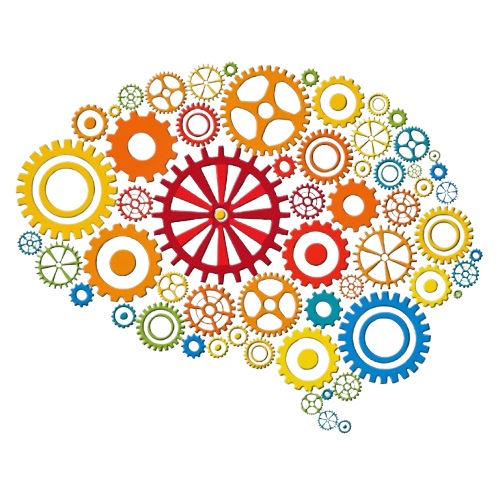

# Cognitive Modeling Spring 2025
> Team members: Itamar Oren-N, Annabelle Choi

## Why is cognitive modeling important for psychology and cognitive science?

1. **Understanding Cognitive Processes**
   - Models can simulate how the brain processes information (like memory, attention, decision-making, etc)
   - Helps refine theories of how we think, remember, and act

2. **Theory Testing**
   - Models allow researchers to formalize and test cognitive theories
   - Offers a way to validate or refine hypotheses about mental functions

3. **Predictive**
   - Models can predict cognitive behaviors and outcomes, which can then be tested
        - Example: Predicting how multitasking affects performance

4. **Exploring Cognitive Limits**
   - Models explore cognitive limits (like memory capacity and attention span) and their implications for real-world tasks
   - Useful in designing better tools, apps, or educational methods

5. **Individual Differences**
   - Tailors models to individual cognitive profiles (like memory or attention variations)
   - Helps in diagnosing cognitive disorders or understanding learning differences

6. **Guiding Interventions**
   - Models inform therapies and cognitive rehabilitation
        - for an example of user for alzheimers, see [this link](https://alz-journals.onlinelibrary.wiley.com/doi/10.1002/alz.13886)
   - Offers targeted strategies for cognitive impairments or developmental issues

7. **Improving Experimental Design**
   - Cognitive models help design experiments that directly test cognitive theories
   - Streamlines hypothesis testing by simulating experimental conditions

8. **Advancing Interdisciplinary Research**
   - Serves as a sort of bridge between psychology, neuroscience, and AI

